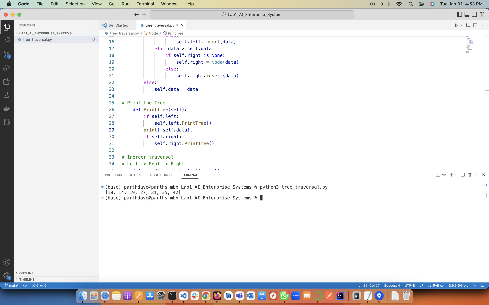

# LAB1
Traversal is a process to visit all the nodes of a tree and may print their values too. Because, all nodes are connected via edges (links) we always start from the root (head) node. That is, we cannot randomly access a node in a tree. There are three ways which we use to traverse a tree −

    In-order Traversal
    Pre-order Traversal
    Post-order Traversal

Screenshot:

